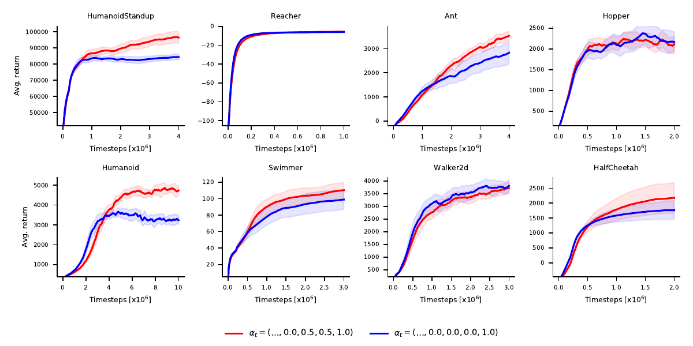
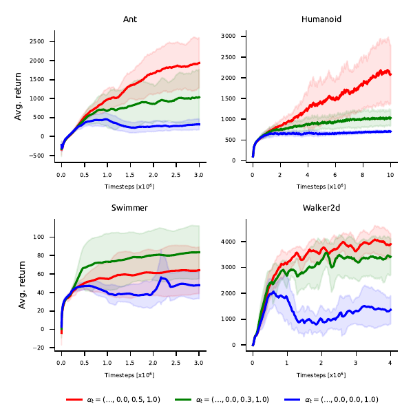

## Policy Optimization Through Approximate Importance Sampling

Code to replicate the experiments from the paper:
```
https://arxiv.org/pdf/1910.03857.pdf
```

In this paper we propose policy optimization objective deriving the value function of the 
target policy via approximate importance sampling. 
While running an algorithm, you can specify a vector of alphas, e.g. `0.5 0.5 1.0` 
that will determine how well you approximate the value of target policy. Longer vectors
closer to `1.0 1.0 ... 1.0 1.0` will result in better approximation, but introduce additional
variance to policy optimization. Decreasing these values reduces the variance, but introduces the bias.
The choice of '1.0' corresponds to PPO. We recommend using `0.5 0.5 1.0` as an ad hoc setting.

The derived algorithm outperforms PPO on experimental benchmarks:


The algorithm we develop is also more robust to suboptimal hyperparameters.
See the figure below where we compare to PPO with too high clip value (blue curve):



To run code, create and activate the environment by
```
conda env create -f environment.yml
conda activate potais
```
Then you can run code simply via
```
python run.py --env HalfCheetah-v3 --num_timesteps 1000000 --alphas '0.5 0.5 1.0'
```

You can also run all the experiments in the paper by
```
python run_all.py --alphas '0.5 0.5 1.0'
```
This will store the results in `results` folder.
